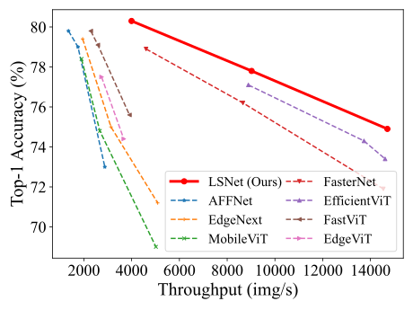

# [LSNet: See Large, Focus Small](https://arxiv.org/abs/2503.23135)


Official PyTorch implementation of **LSNet**. CVPR 2025.

<p align="center">
   <br>
  Models are trained on ImageNet-1K and the throughput
 is tested on a Nvidia RTX3090.
</p>

[LSNet: See Large, Focus Small](https://arxiv.org/abs/2503.23135).\
Ao Wang, Hui Chen, Zijia Lin, Jungong Han, and Guiguang Ding\
[](https://arxiv.org/abs/2503.23135) [](https://huggingface.co/jameslahm/lsnet/tree/main) [](https://huggingface.co/collections/jameslahm/lsnet-67ebec0ab4e220e7918d9565)

We introduce LSNet, a new family of lightweight vision models inspired by dynamic heteroscale capability of the human visual system, i.e., "See Large, Focus Small". LSNet achieves state-of-the-art performance and efficiency trade-offs across various vision tasks.

<details>
  <summary>
  <font size="+1">Abstract</font>
  </summary>
Vision network designs, including Convolutional Neural Networks and Vision Transformers, have significantly advanced the field of computer vision. Yet, their complex computations pose challenges for practical deployments, particularly in real-time applications. To tackle this issue, researchers have explored various lightweight and efficient network designs. However, existing lightweight models predominantly leverage self-attention mechanisms and convolutions for token mixing. This dependence brings limitations in effectiveness and efficiency in the perception and aggregation processes of lightweight networks, hindering the balance between performance and efficiency under limited computational budgets. In this paper, we draw inspiration from the dynamic heteroscale vision ability inherent in the efficient human vision system and propose a "See Large, Focus Small" strategy for lightweight vision network design. We introduce LS (<b>L</b>arge-<b>S</b>mall) convolution, which combines large-kernel perception and small-kernel aggregation. It can efficiently capture a wide range of perceptual information and achieve precise feature aggregation for dynamic and complex visual representations, thus enabling proficient processing of visual information. Based on LS convolution, we present LSNet, a new family of lightweight models. Extensive experiments demonstrate that LSNet achieves superior performance and efficiency over existing lightweight networks in various vision tasks.
</details>

## Classification on ImageNet-1K

### Models
- \* denotes the results with distillation.
- The throughput is tested on a Nvidia RTX3090 using [speed.py](./speed.py).

| Model | Top-1 | Params | FLOPs | Throughput | Ckpt | Log |
|:-:|:-:|:-:|:-:|:-:|:-:|:-:|
| LSNet-T | 74.9 / 76.1* | 11.4M | 0.3G | 14708 | [T](https://huggingface.co/jameslahm/lsnet/blob/main/lsnet_t.pth) / [T*](https://huggingface.co/jameslahm/lsnet/blob/main/lsnet_t_distill.pth) | [T](logs/lsnet_t.log) / [T*](logs/lsnet_t_distill.log) |
| LSNet-S | 77.8 / 79.0* | 16.1M | 0.5G | 9023  | [S](https://huggingface.co/jameslahm/lsnet/blob/main/lsnet_s.pth) / [S*](https://huggingface.co/jameslahm/lsnet/blob/main/lsnet_s_distill.pth) | [S](logs/lsnet_s.log) / [S*](logs/lsnet_s_distill.log) |
| LSNet-B | 80.3 / 81.6* | 23.2M | 1.3G | 3996  | [B](https://huggingface.co/jameslahm/lsnet/blob/main/lsnet_b.pth) / [B*](https://huggingface.co/jameslahm/lsnet/blob/main/lsnet_b_distill.pth) | [B](logs/lsnet_b.log) / [B*](logs/lsnet_b_distill.log) |

## ImageNet  

### Prerequisites
`conda` virtual environment is recommended. 
```bash
conda create -n lsnet python=3.8
pip install -r requirements.txt
```

### Data preparation

Download and extract ImageNet train and val images from http://image-net.org/. The training and validation data are expected to be in the `train` folder and `val` folder respectively:
```
|-- /path/to/imagenet/
    |-- train
    |-- val
```

### Training
To train LSNet-T on an 8-GPU machine:
```bash
python -m torch.distributed.launch --nproc_per_node=8 --master_port 12345 --use_env main.py --model lsnet_t --data-path ~/imagenet --dist-eval
# For training with distillation, please add `--distillation-type hard`
# For LSNet-B, please add `--weight-decay 0.05`
```

### Testing 
```bash
python main.py --eval --model lsnet_t --resume ./pretrain/lsnet_t.pth --data-path ~/imagenet
```
Models can also be automatically downloaded from 🤗 like below.
```python
import timm

model = timm.create_model(
    f'hf_hub:jameslahm/lsnet_{t/t_distill/s/s_distill/b/b_distill}',
    pretrained=True
)
```

## Downstream Tasks
[Object Detection and Instance Segmentation](detection/README.md)<br>
[Semantic Segmentation](segmentation/README.md)<br>
[Robustness Evaluation](README_robustness.md)

## Acknowledgement

Classification (ImageNet) code base is partly built with [EfficientViT](https://github.com/microsoft/Cream/tree/main/EfficientViT), [LeViT](https://github.com/facebookresearch/LeViT), [PoolFormer](https://github.com/sail-sg/poolformer) and [EfficientFormer](https://github.com/snap-research/EfficientFormer). 

The detection and segmentation pipeline is from [MMCV](https://github.com/open-mmlab/mmcv) ([MMDetection](https://github.com/open-mmlab/mmdetection) and [MMSegmentation](https://github.com/open-mmlab/mmsegmentation)). 

Thanks for the great implementations! 

## Citation

If our code or models help your work, please cite our paper:
```BibTeX
@misc{wang2025lsnetlargefocussmall,
      title={LSNet: See Large, Focus Small}, 
      author={Ao Wang and Hui Chen and Zijia Lin and Jungong Han and Guiguang Ding},
      year={2025},
      eprint={2503.23135},
      archivePrefix={arXiv},
      primaryClass={cs.CV},
      url={https://arxiv.org/abs/2503.23135}, 
}
```